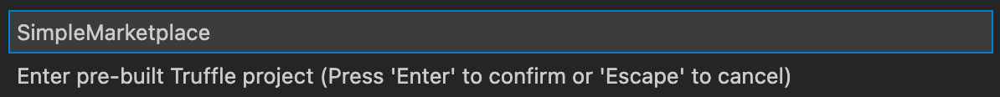
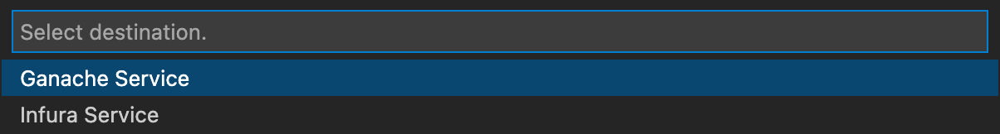
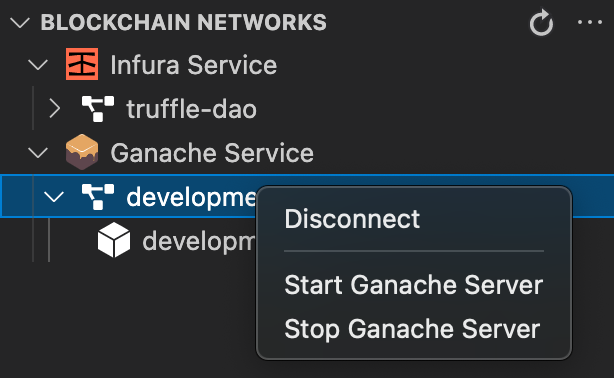
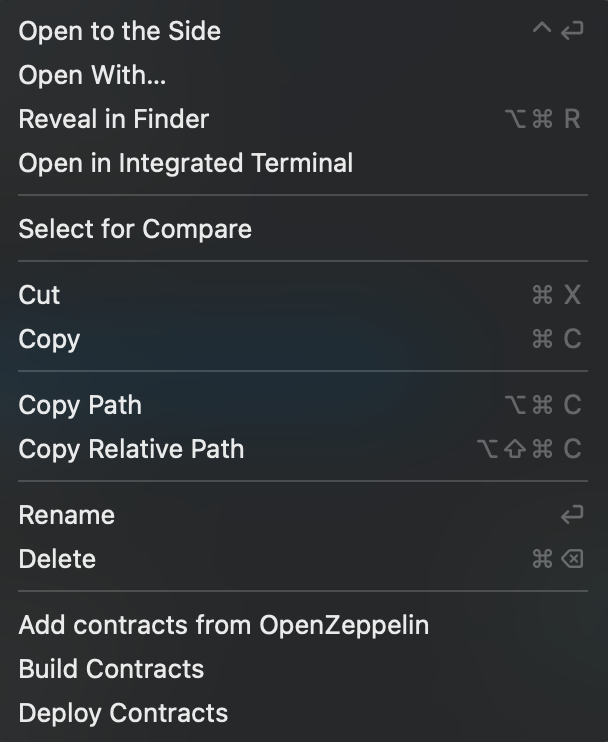
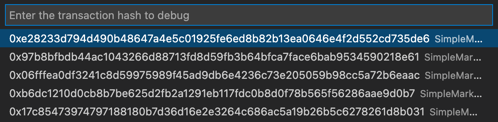
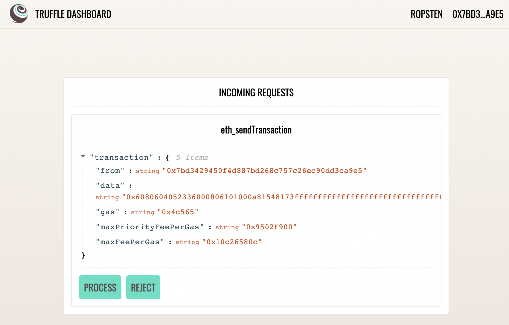

# Simple Marketplace 🛍

This box showcases the functionality of the Trufflesuite for VSCode Extension.

> Note that the following steps assume you have the extension installed.

## Prerequisites

- Truffle (`npm i -g truffle@dashboard`)
- Ganache 7 (`npm i -g ganache`)

## Installation

From the command palette select "Truffle: New Solidity Project", followed by "Create Project from Truffle box" and select a location in your local filesystem where you want the project to be created.

In the resultant dialog, type: "SimpleMarketplace" and hit enter.



## Create a local ganache instance

From the command palette, select "Truffle: Create a new network" and select "Ganache Service". Type "development" as the network name.



You'll now be able to start and stop these instances by right-clicking on the network instance. Go ahead and start the Ganache instance.



## Build and deploy your marketplace

Right-clicking on a contract, such as `SimpleMarketplace.sol` should bring up the following context menu. Simply click build, followed by deploy once this has completed.



## Make an offer 💰

From the terminal run the following script:

```
truffle exec scripts/offer.js
```

## Debug 🐞

From the command palette, select "Truffle: Debug Transaction" and select the most recent transaction (top of the list). 



## Deploy to a Testnet ✨

To deploy via Truffle Dashboard, ensure the service is running with the following:

```
truffle dashboard
```

You'll now be able to view the Dashboard UI at the following (default): http://localhost:24012/

To initiate the deployment, select "dashboard" from the deployment list.


This will trigger the deployment through the dashboard and you'll be able to sign the deployment txns with Metamask 🥳


